# Agentic Context Engineering

> **Audience:** Contributors | AI agents | Maintainers
> **Status:** Reference architecture
> **Owner:** Agent Context
> **Last Verified:** 2026-09-27
> **Source Anchors:** [`AGENTS.md`](../AGENTS.md), [`.agents/CONTEXT_ENGINEERING.md`](../.agents/CONTEXT_ENGINEERING.md), [Target Workflow](TARGET_WORKFLOW.md), `.agents/contract/intents.yaml`, [`project.yaml`](../project.yaml)

This is the portable engineering cockpit's reference architecture: a deterministic, token-aware, multi-harness workflow for child repositories under `repos/<name>/`. It describes an operating model, not automation that every harness necessarily provides.

## 1. Design Philosophy

Agent failures usually come from context drift, untested assumptions, post-hoc tests, and execution sprawl. The cockpit uses seven invariants:

1. **Smallest decision-complete context.** Retrieve what the next decision needs, ledger it by `path + symbol/heading + revision`, and do not reread unchanged input.
2. **Structural discovery with fallback.** Use graph callers, callees, flows, and tests when available. Otherwise use repository search and language tooling; a graph is optional.
3. **Behavior before implementation.** Express observable scenarios and create a failing test at a public seam before production code.
4. **Target-first authority and scoped adapters.** Discover target contracts and native skills first. Target requirements win overlapping conflicts while compatible cockpit workflow remains active.
5. **Phase-atomic delivery.** Each phase owns literal paths, verification, and a declarative commit contract. Git, not markdown, records hashes.
6. **Self-contained human interaction.** Chat is the developer console. Humans never need to open a plan merely to decode a question.
7. **One clone-local task ledger.** Planning starts in the clone; isolated execution moves the entire sole task directory into its task worktree.

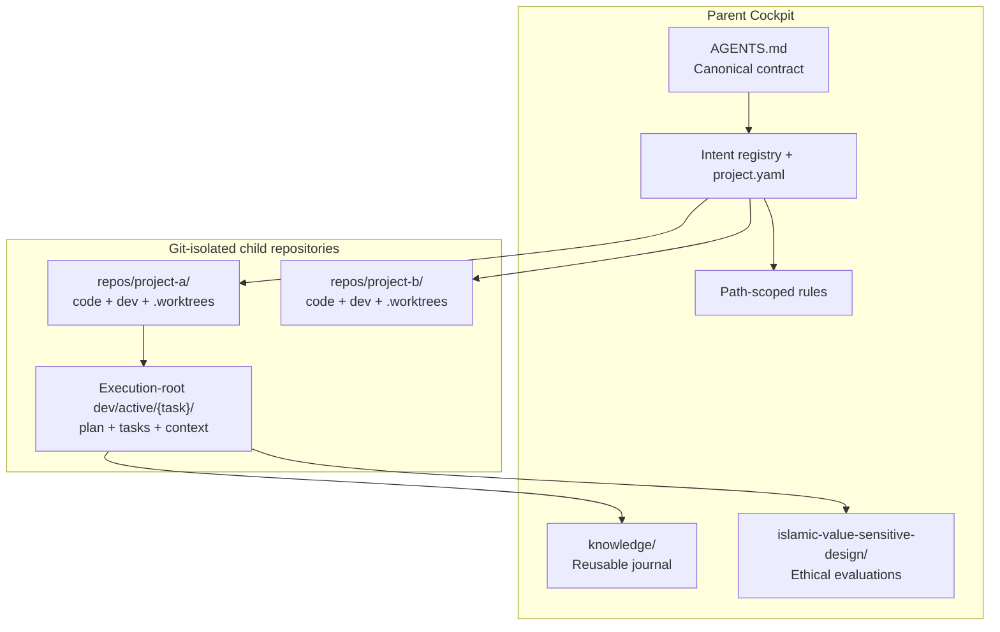

Build, test, lint, and child Git commands use the resolved clone or task
worktree as `Cwd`. `project.yaml` commands are execution-root-relative strings
or `null`; they never embed `cd`. The child's rules, license, compatibility
promise, and contribution contract prevail. Greenfield breaking-change freedom
is explicit opt-in only. Anonymous reads are not a global default.

## 2. Three Operational Tiers

| Tier | Invocation | Responsibility |
|---|---|---|
| Orchestration | Explicit human request | Ethical framing, planning, adversarial review, execution |
| Phase closure | Planning dependency or standalone action | Author and validate path-limited declarative commit contracts |
| Domain guardrails | Intent/path activated | Apply security, test, privacy, API, and operational constraints |

These workflow tiers are distinct from work criticality.

## 3. Canonical Five-Stage Lifecycle

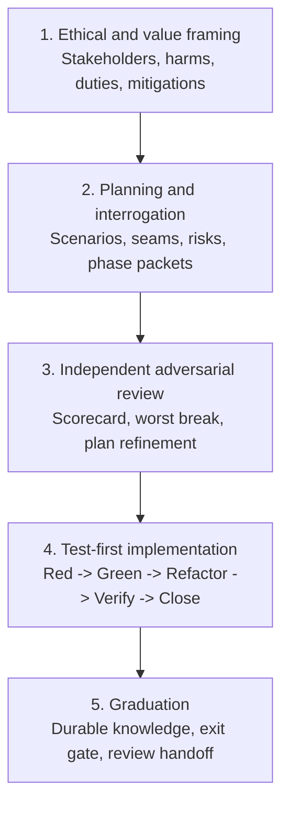

### Stage 1: Ethical and value framing

Identify affected people, power asymmetries, rights, foreseeable misuse,
mitigations, and uncertainty. Store requested durable evaluations under
`islamic-value-sensitive-design/` as `i-vsd-<project>-<task>.md`; the shared
cockpit filename retains project identity even though target-local task
directories do not. Never manufacture an evaluation.

### Stage 2: Planning and interrogation

Create `repos/<project>/dev/active/<task>/` only for real work.
Translate the request into RFC 2119 requirements and `GIVEN`/`WHEN`/`THEN`
scenarios. Identify public seams, rollback or forward recovery, owned paths, and
verification. Pre-author phase commit titles, rationale, and literal paths.

### Stage 3: Independent adversarial review

A fresh reviewer checks completeness, correctness, and coherence; asks for the worst credible break; challenges authority, concurrency, privacy, migration, and recovery assumptions; and folds accepted results into the triad. Do not create orphaned review sidecars.

### Stage 4: Test-first implementation

Resolve the child and commands from `project.yaml`, refresh target instructions
and native skills in the actual execution root, and execute one phase at a time.
For isolated work, move the whole sole task directory into
`.worktrees/<task>/dev/active/<task>/` before implementation. Red establishes
behavior, minimal code turns green, and refactoring preserves green. Close only
phase-owned paths.

### Stage 5: Graduation

Run the plan-exit gate and review standards plus intent fidelity. Promote only
durable knowledge. Accepted deferrals and local notes stay clone-root under
task-namespaced `dev/backlog/` and `dev/notes/`; reusable findings enter cockpit
`knowledge/journal.md`; consequential decisions use the child's preferred
record format. Empty structure is preferable to imported or invented findings.

## 4. Multi-Session Cognitive Isolation

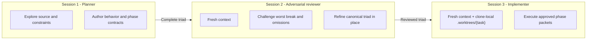

Isolation removes self-confirmation pressure and stale exploration noise. The reviewer assesses an external artifact rather than defending earlier tokens; the implementer spends context on current diagnostics and source. Review capability should match criticality.

The **sole execution-root triad is the inter-session serialization protocol**.
If a constraint, edge case, or verification requirement is absent, a later
session cannot be expected to remember it.

## 5. Zero-Knowledge Cold Start and Criticality 0-4

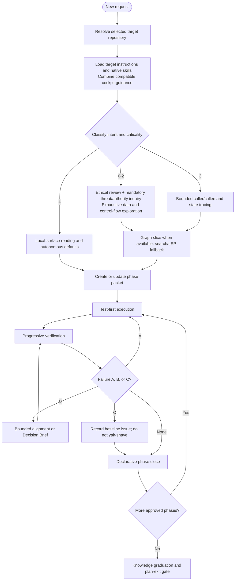

| Level | Domain | Intake | Exploration | Verification | Review |
|---|---|---|---|---|---|
| **0 Sovereign** | Money, irreversible state, safety-critical authority | Mandatory adversarial interview | Exhaustive flows, locks, retries, side effects | Concurrency and rollback invariant breakers at real boundaries | Independent specialist or multi-agent review |
| **1 Security** | Authentication, authorization, secrets, trust boundaries | Mandatory threat-model inquiry | Exhaustive identity, policy, caller, and failure paths | Fail-closed, spoofing, replay, provider-boundary tests | Independent security review |
| **2 Privacy** | Personal data, retention, erasure, export, telemetry | Mandatory data-authority inquiry | End-to-end data and sink tracing | Anti-resurrection, redaction, purge, retention tests | Independent privacy review |
| **3 Domain state** | Business rules, state machines, persistence contracts | Clarify material ambiguity | Bounded state and caller trace | Behavioral unit plus focused integration tests | Peer review |
| **4 Standard UI/docs** | Presentation, style, prose, agent context | Autonomous defaults | Local surface | Render/schema/link or diff checks | Lightweight self-check |

Use the highest implicated level. Criticality scales rigor but never overrides child-mandated checks.

## 6. Dev-Doc Triad and State Machine

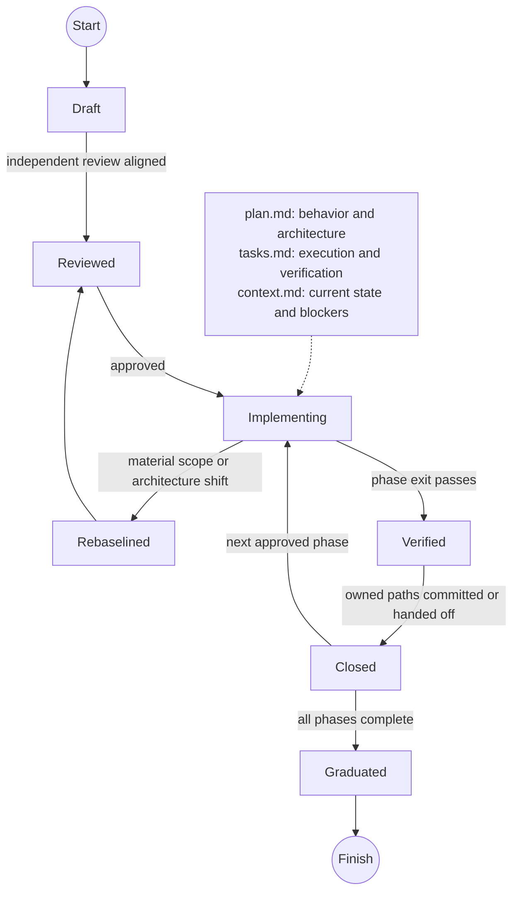

| Artifact | Owns | Must not contain | Update cadence |
|---|---|---|---|
| `plan.md` | Architecture, decisions, scenarios, risks, rollback | Checkboxes, ephemeral progress, session logs | Only when design/scope changes |
| `tasks.md` | Red/Green/Refactor tasks, status, commands, commit contracts | Long design debate, handoffs, commit hashes | Planning and execution |
| `context.md` | Quick resume, blockers, evidence, baseline failures | Duplicate plan, full source, transcript, commit hashes | Session start, blocker, handoff |

### Rolling context compaction

Keep `context.md` below roughly 200-300 lines or 15 KB. After phase closure: replace detail with a one-line checkpoint; promote reusable learning; move only accepted deferrals; delete obsolete diagnostics; let Git remain commit history. Do not add phases for every discovery. Material scope changes require a self-contained Decision Brief.

## 7. Zero-Loss Review and Research Integration

Standalone review and research files become orphaned. Fold accepted information into canonical destinations:

| Information | Destination |
|---|---|
| Review score and state | `plan.md` metadata and `context.md` review state |
| Current behavior, callers, seams | `plan.md` current-state section |
| Socratic questions and accepted answers | Requirements, scenarios, decisions |
| Worst-break failure | Plan risk/testing sections plus Red tasks |
| Ranked risks and mitigations | Plan risk register and compact context reminders |
| Removed/replaced behavior | Migration/compatibility section, subject to child policy |
| Execution and commit boundaries | `tasks.md` |

Zero-loss preserves meaningful decisions, not raw dumps or every rejected idea.

## 8. Human Interaction Boundary

The triad is machine memory; chat is the developer console. Every pause, approval, blocker, or milestone uses a **Decision Brief**:

1. Current position in plain language.
2. Descriptive component names, never bare IDs.
3. Exact decision and why it matters.
4. Numbered options with a recommendation and material trade-offs.
5. Immediate action after the reply.

At plan exit provide outcome, architecture, human-readable phases, decisions, risks, worst break, and approval request. Paths may accompany but not replace it.

## 9. Execution Topology and Isolation

Resolve `target.path` as `repos/<name>`. Planning uses the clone. Isolated
implementation uses clone-relative `.worktrees/<task>/`; every child command
uses the resolved execution root as `Cwd` and invokes an execution-root-relative
command.

| Case | Condition | Action |
|---|---|---|
| Existing task worktree | Worktree and sole task directory exist | Refresh instructions/skills and resume there |
| Existing in-tree work | Explicit in-tree task is in progress | Resume the clone-local triad in place |
| Fresh isolated work | New approved plan | Create `.worktrees/<task>/`, verify exclusions/collisions, then move the whole sole task directory |
| Large cohort migration | Many disjoint path cohorts | Hub-and-spoke only with ownership; bound and prune spokes |

Local exclusions use the selected clone's resolved shared Git `info/exclude`
only: exact task paths plus `/.worktrees/`. Never edit a tracked `.gitignore`,
global excludes, or force-stage cockpit state. Verify no tracked/content
collision and effective ignore behavior before writing or moving. Keep
clone-root backlog and notes outside worktrees, retain ignored material before
authorized cleanup, and never delete a worktree merely because review opened.
See [Target Workflow](TARGET_WORKFLOW.md) for the complete procedure.

### Expand/contract protocol

Unless the child opted into a break:

1. **Characterize** behavior and consumers.
2. **Expand** with the new seam while the old remains valid.
3. **Migrate** consumers in bounded verified cohorts.
4. **Contract** only after usage is zero and policy allows removal.
5. **Verify** architecture and absence of accidental shims.

## 10. Phase Cadence and Declarative Commit Contracts

1. **Red:** deterministic failing behavior through a public seam. Minimal compilable signatures are acceptable; compilation failure is not Red.
2. **Green:** smallest production change satisfying the test.
3. **Refactor:** improve structure while behavior remains green.
4. **Verify:** Ring 1, then Ring 2.
5. **Close:** inspect and stage owned files. Material divergence requires revising the contract first.

```markdown
#### Planned Commit Contract
- **Title:** `fix(scope): reject stale state before mutation`
- **Rationale:** Preserve authoritative state for an expired precondition.
- **Release impact:** User-visible bug fix
- **Files:** `src/path/to/implementation`, `tests/path/to/behavior`
```

A declarative contract does not authorize unrelated paths and never stores a commit hash.

## 11. Three Rings and Failure Triage

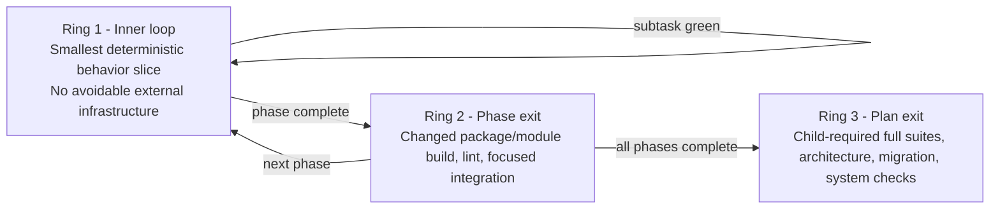

Budgets are project-defined. Source-project latency and provider counts are not universal. A `null` command is unavailable, not permission to invent one.

| Class | Meaning | Action |
|---|---|---|
| **A - Direct regression** | Changed behavior or phase-owned code fails | Fix before phase close |
| **B - Induced ripple** | Unchanged caller/fixture breaks from the contract | Align if bounded; otherwise Decision Brief |
| **C - Baseline rot** | Failure reproduces on untouched child base | Record bounded evidence and quarantine |

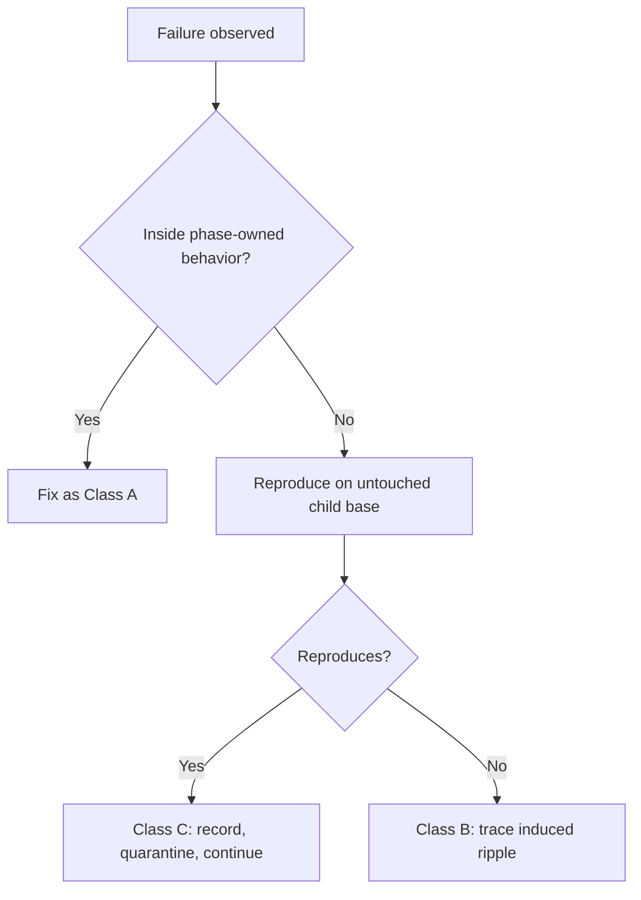

Never relabel a regression as baseline rot. Unless time is under test, no fixed sleeps: subscribe before triggering and await a bounded signal. Mock external boundaries, not the integration asserted.

## 12. Test Seam Architecture

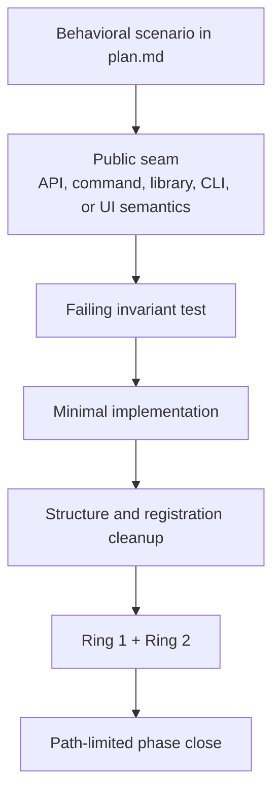

Expected values come from literals, worked examples, standards, or specifications, not production formulas. Tests assert behavior rather than private fields or prose. Product tests do not parse governance markdown unless it is a shipped machine-consumed contract.

## 13. Disciplined Bug Diagnosis

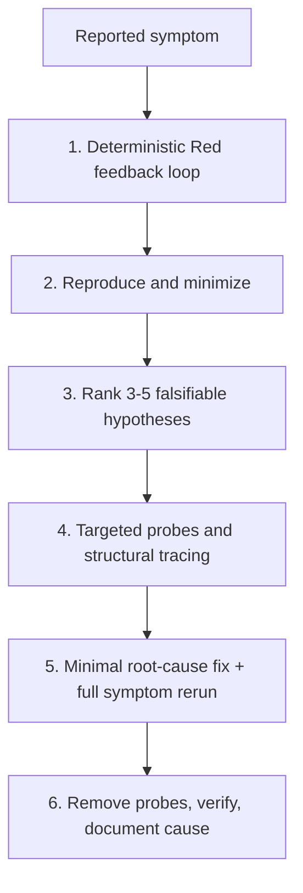

Spend diagnosis effort on faithful reproduction. Do not edit production code before a deterministic feedback loop unless impossible; then state why. Temporary probes use a searchable marker and leave zero residue.

## 14. Two-Axis Review and Right-Sizing

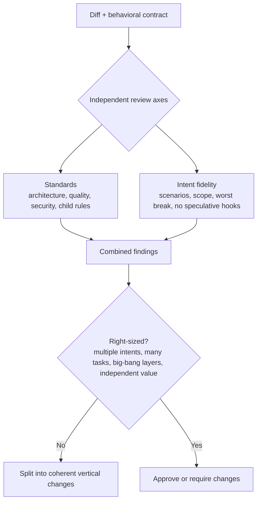

Review both axes. The smell baseline is Mysterious Name, Duplicated Code, Feature Envy, Primitive Obsession, Data Clumps, Shotgun Surgery, Divergent Change, Speculative Generality, Message Chains, Middle Man, Repeated Switches, and Refused Bequest.

## 15. Knowledge Graduation Gate

Before completion:

- Convert accepted unresolved work into a bounded backlog item.
- Record architecture in the child's chosen format.
- Promote evidenced reusable findings under
  [`PROMOTION_RULES.md`](../knowledge/PROMOTION_RULES.md).
- Run child-configured Ring 3 checks after any required base update.
- Review the child diff and ensure no cockpit file is staged there.
- Report delivered behavior, integration repairs, baseline issues, and validation limits separately.

Graduation is selective compaction, not an archive dump. Clone-local active,
backlog, and notes directories never inherit another project's tasks or
findings. Reusable knowledge promoted to the cockpit retains its source
project/task provenance.

## 16. Harness and Rule Synchronization

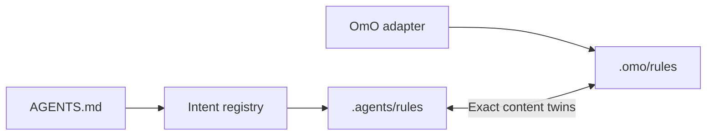

Only the three files present in both rule trees are asserted as twins. They are regular files, not symlinks, and byte-identical. Other adapters point to the root contract or document narrow behavior; absence is not evidence of automation.

## 17. Lightweight Workflow Guard Boundary

The cockpit is not an agent operating system. It does not ship workstream
manifests, concatenated triad digests, approval receipt chains, file-claim
daemons, heartbeats, custom context compilers or harness-wide execution
authority. Native harness task tools may track execution, but the sole
clone/worktree triad remains the portable inter-session record.

The source's executable workflow guard is deliberately not extracted. Its
portable checks remain: the intent catalog is a bounded valid YAML document,
and commit packets name distinct literal owned files rather than directories,
globs, traversal, rooted paths or Git pathspec magic. Validate the data and
inspect the intended command; validation never executes Git or grants approval.
Use the target's own existing guard when one is part of its contribution policy.

## 18. Related Documentation

- [`QUICK_REFERENCE.md`](QUICK_REFERENCE.md) - high-signal invariants.
- [`GOVERNANCE.md`](GOVERNANCE.md) - contribution and design governance.
- [`OPERATIONS.md`](OPERATIONS.md) - child command and verification model.
- [`DOCUMENTATION_ARCHITECTURE.md`](DOCUMENTATION_ARCHITECTURE.md) - docs ownership.
- [`legal/IP_GOVERNANCE.md`](legal/IP_GOVERNANCE.md) - provenance controls.
- [`TARGET_WORKFLOW.md`](TARGET_WORKFLOW.md) - target discovery, exclusions,
  single-triad movement, worktrees, and cleanup.
